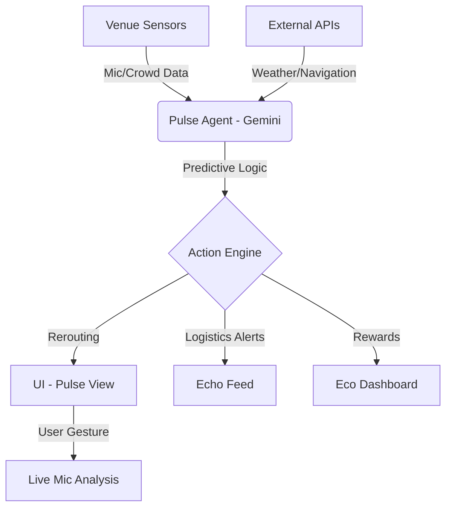

# 🏟️ StadiumPulse | The Kinetic Horizon

<p align="center">
  
</p>

<p align="center">
  
  
  
  
  
  
</p>

---

**StadiumPulse** is an intelligent, high-density venue logistics engine designed to orchestrate chaos with the precision of a spotlight. Designed for massive events (IPL Cricket, Concerts, Comedy Sets), it merges real-time spatial modeling, AI-driven autonomous logic, and environmental intelligence into a "Command Center" experience.

## ✨ Core Features

### 📡 Pulse View: Live Arena Intelligence
Experience the stadium like never before with a real-time, WebXR-ready density map.
- **Dynamic Heat Zones**: Real-time visualization of crowd pressure points.
- **Acoustic Intelligence**: Live microphone noise sensing (dB) calibrated for high-density environments.
- **Spatial Wayfinding**: Adaptive routing that reacts to current aisle density.

<p align="center">
  
</p>

### 🤖 Pulse Agent: The Autonomous Supervisor
At the heart of the platform is an **Agentic Logic Layer** powered by Gemini.
- **Proactive Compensation**: Automatically issues staff alerts or fan discounts if friction (e.g., long queue times) is detected.
- **Aisles Locking Logic**: Intelligent entry/exit point control based on game clock and crowd flow.
- **Predictive Bottlenecks**: AI identifies potential issues 5-10 minutes before they occur.

### 🌊 Echo Feed: The Crowd Mesh
A live event mesh that bridges the gap between official data and fan sentiment.
- **Acoustic Narration**: Inclusive design featuring AI-narrated audio cues for visually impaired fans.
- **Fan Echoes**: Real-time community sentiment tracking integrated with venue logistics.

<p align="center">
  
</p>

### ♻️ Eco-Symmetry Dashboard
Sustainability isn't an afterthought. StadiumPulse tracks and gamifies environmental impact.
- **Carbon Displacement**: Tracks the CO₂ savings of fan-driven "Green Actions."
- **Eco-Gamification**: Fans earn points for sustainable choices directly within the command center.

## 🏗️ Technical Architecture



## 🛠️ Tech Stack & Philosophy

- **Frontend**: Next.js 16 (App Router), React 19, Tailwind CSS v4.
- **State Management**: React Context API with persistent `EventStateController`.
- **Audio Processing**: Web Audio API for real-time RMS-to-dB conversion.
- **Inclusive Design**: ARIA-optimized high-density visual components.

## 🚀 Getting Started

Ensure you have Node.js 18+ installed.

1. **Clone the repository**:
   ```bash
   git clone https://github.com/harshshukla2016/stadiumpulse.git
   cd stadiumpulse
   ```

2. **Install dependencies**:
   ```bash
   npm install
   ```

3. **Run the development server**:
   ```bash
   npm run dev
   ```

4. **Experience the Pulse**:
   Open [http://localhost:3000](http://localhost:3000) in your browser.

## 📂 Project Structure

```text
├── public/                 # Static assets (Hero, Profile, Logos)
├── src/
│   ├── app/                # Next.js App Router (API Routes & Pages)
│   ├── components/         # Professional UI Components
│   │   ├── views/          # Module pages (Pulse, Echo, Hub, Eco)
│   │   └── PulseAgent.tsx  # Central AI Logic Component
│   ├── context/            # Global Event State Control
│   └── lib/                # API Integrations & Utilities
```

## 👨‍💻 Creator

Built with passion by **Harsh Kumar Shukla** — SAP SD Consultant & Full-Stack Developer.

[](https://harsh-kumar-shukla-portfolio.vercel.app/)
[](https://github.com/harshshukla2016/stadiumpulse)

---
*StadiumPulse: Orchestrating the Kinetic Horizon.*
